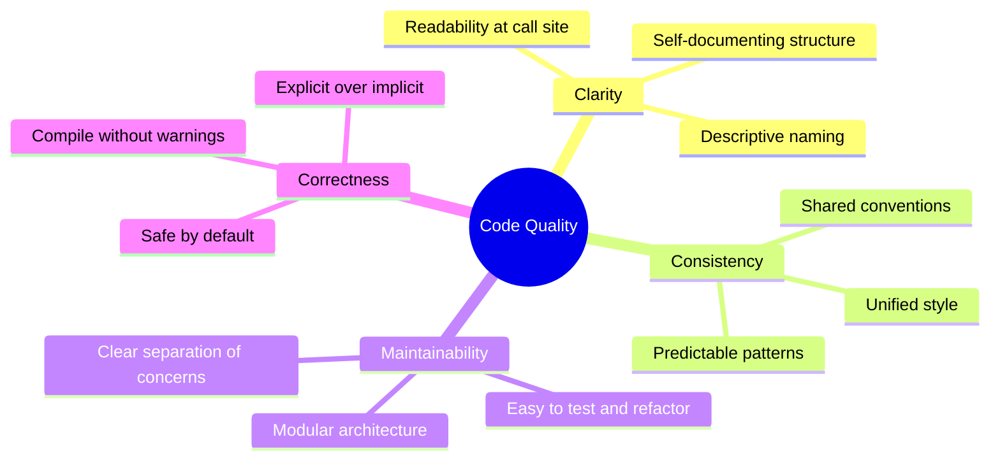
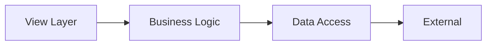

# 📜 Swift & SwiftUI Code Quality Manifesto
A concise guide to writing clear, maintainable Swift and SwiftUI code, based on best practices.

## 🧭 Core Philosophy

**Key pillars (in priority order):**
1. **Clarity** at usage point.
2. **Consistency** across code.
3. **Brevity** as a byproduct, not goal.

## 📁 File Organization
### Naming
- Primary files: Name after main type (e.g., `UserProfileView.swift`).
- Protocol extensions: Use `+` (e.g., `User+Encodable.swift`).
- Multiple extensions: Descriptive prefix (e.g., `MyType+Additions.swift`).

### Structure
Organize as:
1. File docs.
2. Sorted imports.
3. Declarations.
4. Extensions.

**Example View File:**
```swift
// ContentView.swift
import SwiftUI
import Combine

struct ContentView: View {
    @StateObject private var viewModel = ContentViewModel()
    
    var body: some View {
        NavigationView {
            listView
                .navigationTitle("Todo List")
                .toolbar { toolbarContent }
        }
        .onAppear { viewModel.loadInitialData() }
    }
    
    private var listView: some View {
        List {
            ForEach(viewModel.items) { item in
                ItemRowView(item: item)
                    .onTapGesture { viewModel.toggleItem(item) }
            }
            .onDelete { viewModel.deleteItems(at: $0) }
        }
    }
    
    @ToolbarContentBuilder
    private var toolbarContent: some ToolbarContent {
        ToolbarItem(placement: .primaryAction) {
            addButton
        }
    }
    
    private var addButton: some View {
        Button(action: { viewModel.showAddSheet = true }) {
            Image(systemName: "plus")
        }
    }
}

#Preview {
    ContentView()
        .environmentObject(ContentViewModel())
}
```

## ✍️ Naming
Follow Swift guidelines for clarity.

| Category | Convention | Example | Avoid |
|----------|------------|---------|-------|
| Types | UpperCamelCase | `struct UserProfile` | `struct user_profile` |
| Functions/Vars | lowerCamelCase | `func calculateTotal()` | `func CalculateTotal()` |
| Constants | lowerCamelCase | `let maxRetryCount = 3` | `let MAX_RETRY_COUNT = 3` |
| Booleans | Assertions | `isEmpty`, `hasCompleted` | `empty`, `completed` |
| Protocols | Nouns | `Collection` | `Collectable` |
| Capabilities | -able/-ible | `Codable` | `Coding` |

**Rules:**
- Prioritize call-site clarity.
- Omit inferable words.
- Avoid abbreviations.

**Good vs. Bad:**
```swift
// Good
employees.filter { $0.isActive }
var hasCompletedOnboarding: Bool
protocol Drawable { func draw(in: CGContext) }
static func makeDefaultSettings() -> Settings

// Bad
employees.filterActive()
var active: Bool
protocol Draw { func draw(in: CGContext) }
static func create() -> Settings
```

## 🏗️ Architecture
Use layered structure:

**Rules:**
1. Single responsibility.
2. Dependencies inward.
3. Isolate view state.
4. Unidirectional flow.

**SwiftUI Tips:**
- Views lightweight, no logic.
- `@StateObject` for owned ViewModels.
- `@EnvironmentObject` for shared state.
- Extract reusable views.

**Example:**
```swift
class AppState: ObservableObject {
    @Published var userData = UserData()
}

protocol CountriesInteractor {
    func loadCountries()
}

struct RealCountriesInteractor: CountriesInteractor {
    let webRepository: CountriesWebRepository
    let appState: AppState
    
    func loadCountries() {
        appState.userData.countries = .isLoading(last: appState.userData.countries.value)
        _ = webRepository.loadCountries()
            .sinkToLoadable { appState.userData.countries = $0 }
    }
}

struct CountriesList: View {
    @EnvironmentObject var appState: AppState
    @Environment(\.interactors) var interactors: InteractorsContainer
    
    var body: some View {
        listView
            .onAppear { interactors.countriesInteractor.loadCountries() }
    }
}
```

## 🎨 Formatting
- Spaces for indentation.
- Consistent spacing around operators/colons.
- 100-char line limit.
- Braces on same line.
- No semicolons.
- One statement/line.

**Control Flow:**
```swift
// Good: Guard for early exit
func processItem(_ item: Item?) {
    guard let item = item else { return }
    // Process
}

// Bad: Nested if
func processItem(_ item: Item?) {
    if let item = item {
        // Process
    }
}
```

## 🚀 Checklist
### Setup
- [ ] Install SwiftLint.
- [ ] File templates.
- [ ] Naming conventions.
- [ ] CI checks.

### Development
- [ ] Docs first.
- [ ] Single responsibility.
- [ ] Access modifiers.
- [ ] Tests for logic.

### Commit
- [ ] Run SwiftLint.
- [ ] Tests pass.
- [ ] No warnings.
- [ ] Docs complete.